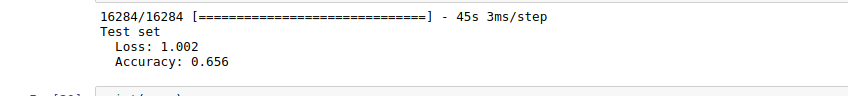
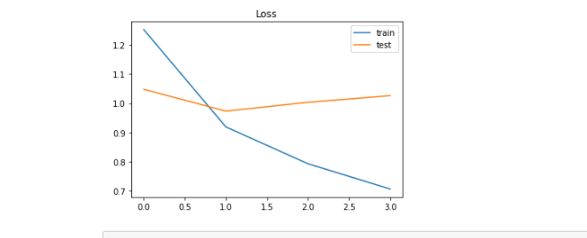
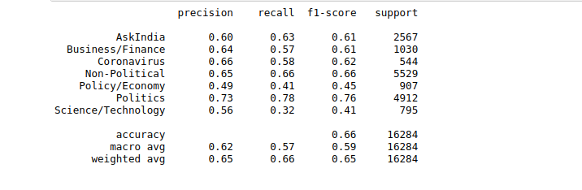
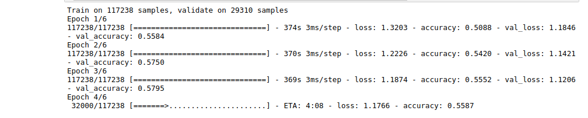

# MIDAS Task

This repository contains code for MIDAS internship task. The task is divided into 5 subtasks:

  - Data Collection
  - EDA
  - Data Cleaning & Modelling
  - Web Service
  - Deployment

## Data Collection
I have used `pushshift` [API](https://github.com/pushshift/api) instead of `PRAW` for this task as using this we can scrape more and older articles than using the `PRAW`. [Link](https://www.reddit.com/r/redditdev/comments/8qx7t7/why_does_praw_limit_number_of_submissions_for/) 
  - Using `pushshift` I have scraped around ~4 lakh submissions from: January 10 2018 to April 10 2020
  - More details in the notebook

## EDA
This includes:
  - Length analysis
  - Time series analysis
  - Selecting appropriate flairs out of 214 collected flairs on basis of their count and recent trend
  - ngram analysis
  - Viral posts
  - Mods of subreddit
  - WordClouds
  - Class distribution

## Data Cleaning and Modelling
  - Cleaned the text by handling contraction, punctuations, URL, HTML, emojis..
  - Initially I thought of finetuning the BERT model, but later on I realised its not possible on my GPU so I'll train it on the cloud later
  - Implemented LSTM model w/o pretrained embeddings: test classification report in notebook
  - Implemented LSTM model with pretrained embeddings (in progress)

Test accuracy (LSTM w/o pretrained embeddings)

Loss (LSTM w/o pretrained embeddings)

Test accuracy (LSTM w/o pretrained embeddings)

Classification Report (LSTM w/o pretrained embeddings)

LSTM with pretrained embeddings in Progress

BERT finetune (in progress)

## Web Service
A web service to know the flair of the submissions is developed using flask, I have used the saved model and weights to make the predictions. It consists of 2 endpoints:
  - `/`: visiting this page renders a HTML page where user can post the link of the submission and on submitting, predicted flair will be displayed. Working: Using the link entered the backend search for the post with the same URL using the `PRAW` after getting the submission we get the `selftext` and `title` from it and use the concatenated text for the prediction.
  
  - `/automated_testing`: This gives the predicted flairs for the links given in a txt file.Provided file is uploaded like this 
    `files = {'upload_file': open('file.txt','rb')}`
    `r = requests.post(url, files=files)` 
- Output is in the JSON format

## Deployment
### The aforementioned service is deployed on Heroku too.
  - `/`: https://reddit-flair-utsav.herokuapp.com/ 
  - `/automated_testing`: https://reddit-flair-utsav.herokuapp.com/automated_testing
